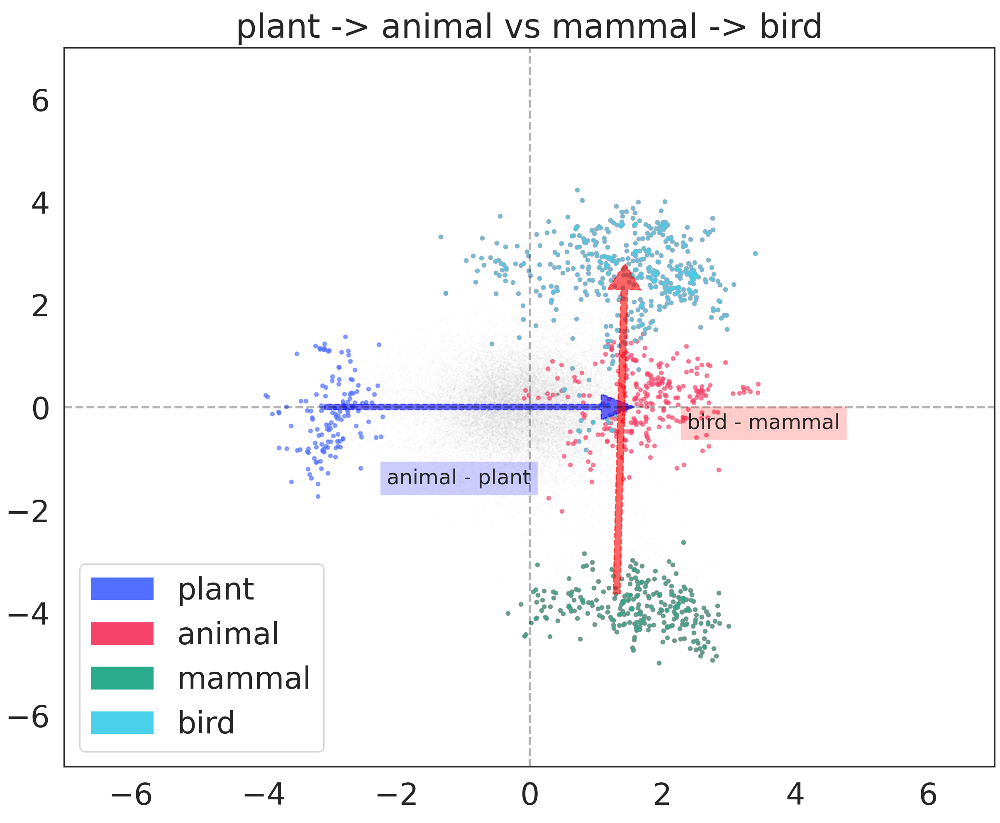
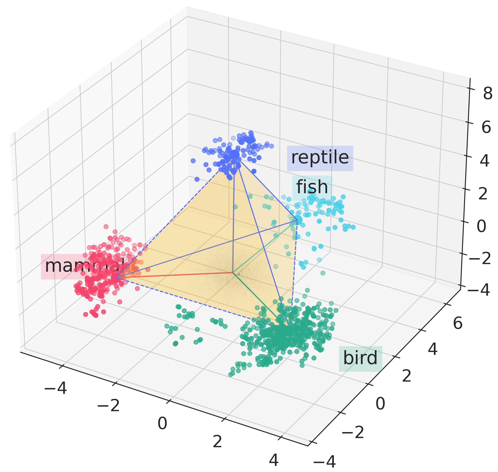
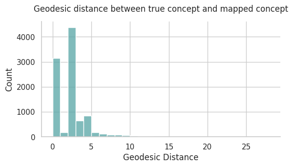

# Applied Natural Language Processing

The repository for the project of the course Applied Natural Language Processing [146170].

In this project, we explored the development of knowledge-based concept token embeddings to bridge the gap between structured knowledge and LLM representations. We then evaluated the embeddings to verify their ability to reconstruct lexical relations and to assess the feasibility of integrating them with LLMs. The results are promising, ensuring the potential for expanding this methodology and highlighting the importance of dataset richness, embedding models, and architectural design in bridging concept embeddings with large language models.

###### This repository consist of 5 sub projects

```
anlp/
├── data_build/        # creating the UKC triplets dataset
├── ukc_embedding/     # training KGE models on the UKC dataset
├── geometry/          # evaluating hierarchical structure in embeddings
├── mapping/           # training an MLP mapper between sentence and concept embeddings
├── wsd/               # fine-tuning a model for the WSD task
└── assets/            # visualization assets
```

### How to use

##### 1. Generate UKC triplets dataset

```bash
cd data_build
python triplets_cut_split.py
```

##### 2. Train KGE model on UKC dataset

```bash
cd ukc_embedding
sh set_env.sh
cd examples
sh train_RotE_UKC_CUT_500.sh # same result reported in the report
```

##### 3. Evaluation of the hierarchy in the concept embeddings

```bash
cd geometry
python run.py
```

##### 4. Training mapper MLP between gloss embedding and concept embedding

```bash
cd mapping
# Needs to run the notebook 📔
```

##### 5. Training and evaluating a WSD

```bash
cd wsd
python main.py --mode train # or
# python main.py --mode experiments
                    # for different hyperparameters
```

### Results from the phases

**Performance metrics from KGE on UKC**

| Model  | Dataset | MRR  | Hits@10 | Hits@3 | Hits@1 |
|-------|---------|------|---------|--------|--------|
| RotE  | UKC     | **0.40** | 0.55 | **0.44** | **0.31** |
| RotH  | UKC     | 0.38 | **0.56** | 0.42 | 0.29 |
| RefH  | UKC     | 0.36 | 0.54 | 0.39 | 0.27 |
| AttH  | UKC     | 0.37 | 0.54 | 0.40 | 0.28 |
| MurP  | UKC     | 0.35 | 0.51 | 0.38 | 0.27 |
| MurE  | UKC     | 0.16 | 0.24 | 0.18 | 0.12 |
| TuckER| UKC     | 0.27 | 0.38 | 0.30 | 0.22 |
| RotH  | WN18RR  | 0.49 | 0.58 | 0.51 | 0.44 |
| MurP  | WN18RR  | 0.48 | 0.56 | 0.49 | 0.44 |

<!-- 
 -->

##### Intrinsic evaluation inside the embedding
the concept embeddings does preserve the hierarchical relation between the concepts

<p>
  <br>
  <em>Hierarchy inside the concept embeddings</em>
</p>

<p>
  <br>
  <em>Concepts represented as polytopes</em>
</p>


##### Extrincsic evaluation
The alignment between LLM-encoded concept glosses and the learned concept representations

<p>
  <br>
</p>


##### Applying in downstream task

**Table: Result of WSD evaluation**

| Architecture       | UKC-WSD | Semantic-WSD |
|--------------------|---------|--------------|
| **Precision**      |         |              |
| All                | 74.2    | 76.0         |
| Seen               | 76.4    | 75.7         |
| Unseen             | 56.2    | 77.4         |
| MultiCandidates    | 66.8    | 70.4         |
| Multi Seen         | 72.2    | 71.3         |
| Multi Unseen       | 26.3    | 62.4         |


### Notice

The datasets used in this project is not uploaded to the repository